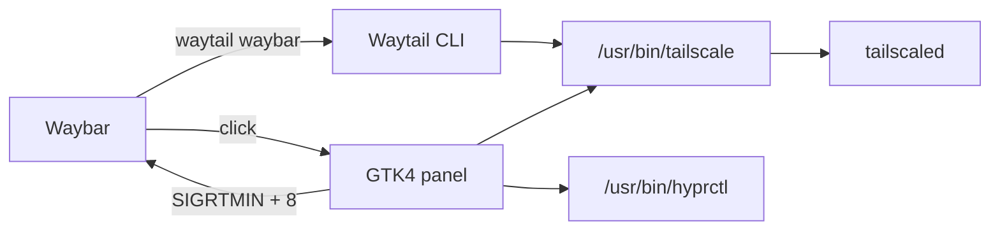

<div align="center">
  
  <h1>Waytail</h1>
  <p>A Waybar-native Tailscale controller for Hyprland.</p>
  <p>
    
    
    
    
    
  </p>
  <p>
    <a href="https://github.com/stackrot/waytail/actions/workflows/ci.yml"></a>
    <a href="https://github.com/stackrot/waytail/releases/latest"></a>
    <a href="LICENSE"></a>
  </p>
</div>

## What is this?

Waytail adds live Tailscale state and controls to Waybar without running another resident daemon. The custom module exposes connection and exit-node state; clicking it opens a Catppuccin Mocha GTK4 panel with device details and a searchable exit-node picker.

It talks directly to the installed Tailscale CLI, locates the focused output through Hyprland, and refreshes every Waybar process owned by the current user with a real-time signal. Waybar does not need to run as a systemd service.



## Features

| Area | Behaviour |
|---|---|
| Waybar | Tailscale status icon, connection tooltip, dynamic state classes and immediate refresh after actions |
| Devices | Online state, addresses, DNS, OS, traffic totals and direct, DERP or peer-relay path |
| Exit nodes | Tailnet nodes and geographically grouped provider nodes with search, active state and direct-mode reset |
| Panel | GTK4 layer-shell overlay on the focused Hyprland monitor, sized to the visible tab with bounded scrolling |
| Theme | Catppuccin Mocha panel and matching Waybar state colours |
| Runtime | No Waytail daemon, shell command execution or systemd unit dependency |

## Runtime inventory

| Component | Tested version | Purpose |
|---|---:|---|
| Hyprland | 0.56.1 | Focused-monitor discovery |
| Waybar | 0.15.0 | JSON module, CSS state image and real-time refresh |
| Tailscale | 1.98.10 | Status and network control |
| Python | 3.14.6 | Backend and panel runtime |
| GTK4 | 4.22.4 | Panel toolkit |
| gtk4-layer-shell | 1.3.0 | Hyprland layer surface |
| PyGObject | 3.56.3 | Python GTK bindings |

Python 3.10 or newer is supported. The runtime deliberately expects `hyprctl` and `tailscale` at `/usr/bin`, and the panel requires an active Hyprland session.

## Install

On Arch Linux or CachyOS:

```bash
sudo pacman -S --needed hyprland python python-gobject gtk4 gtk4-layer-shell tailscale waybar
sudo systemctl enable --now tailscaled
sudo tailscale up
sudo tailscale set --operator="$USER"
```

Run the operator command from your normal desktop user's shell. It allows that user to connect, disconnect and select exit nodes without running Waytail as root. See [Tailscale's operator permission documentation](https://tailscale.com/docs/reference/troubleshooting/linux/linux-operator-permission).

Install Waytail from source:

```bash
git clone https://github.com/stackrot/waytail.git
cd waytail
./scripts/install.sh
```

The installer creates a system-site-enabled virtual environment under `${XDG_DATA_HOME:-$HOME/.local/share}/waytail`, links `waytail` into `${XDG_BIN_HOME:-$HOME/.local/bin}`, and installs the state icons under `${XDG_CONFIG_HOME:-$HOME/.config}/waybar/waytail`. It does not edit Hyprland or Waybar configuration.

Validate the installation:

```bash
waytail --version
waytail status
```

## Waybar

Merge the module into the appropriate Waybar configuration object:

```jsonc
{
    "modules-right": ["custom/waytail"],
    "custom/waytail": {
        "exec": "waytail waybar",
        "return-type": "json",
        "interval": 30,
        "signal": 8,
        "exec-on-event": false,
        "on-click": "waytail panel"
    }
}
```

Add the state styling to Waybar's stylesheet:

```css
#custom-waytail {
    min-width: 16px;
    padding: 0 8px;
    background-image: url("/home/USER/.config/waybar/waytail/tailscale-connected.svg");
    background-position: center;
    background-repeat: no-repeat;
    background-size: 16px 16px;
}

#custom-waytail.exit-node {
    background-image: url("/home/USER/.config/waybar/waytail/tailscale-exit.svg");
}

#custom-waytail.disconnected {
    background-image: url("/home/USER/.config/waybar/waytail/tailscale-disconnected.svg");
}

#custom-waytail.error {
    background-image: url("/home/USER/.config/waybar/waytail/tailscale-error.svg");
}
```

Replace `/home/USER/.config` with the effective `${XDG_CONFIG_HOME:-$HOME/.config}` path; GTK CSS does not expand shell variables or `~`. Complete examples are in [`examples/waybar`](examples/waybar). Restart Waybar after merging the configuration.

## Hyprland

The panel works without a layer rule. Hyprland 0.55 and newer can optionally apply the matching blur in `hyprland.lua`:

```lua
hl.layer_rule({
    name = "waytail-blur",
    match = { namespace = "waytail" },
    blur = true,
    ignore_alpha = 0.2,
})
```

The same snippet is available at [`examples/hyprland.lua`](examples/hyprland.lua).

The panel grows and shrinks with the visible device or exit-node list, including expanded device details and search results. Its height is capped at 680 logical pixels or 75% of the focused monitor's height, whichever is smaller; longer lists scroll within the panel.

## Commands

| Command | Result |
|---|---|
| `waytail waybar` | Emit one Waybar JSON payload |
| `waytail panel` | Toggle the device and exit-node panel |
| `waytail status` | Print the normalised Tailscale state as JSON |
| `waytail connect` | Run `tailscale up` |
| `waytail disconnect` | Run `tailscale down` |
| `waytail set-exit ADDRESS` | Select an exit node without changing LAN-access policy |
| `waytail clear-exit` | Disable the current exit node |

`WAYTAIL_WAYBAR_SIGNAL` controls the real-time signal offset and defaults to `8`. Its value must match the custom module's `signal` setting.

Waytail resumes authenticated connections. If sign-in is required, run `tailscale up` in a terminal to complete it, then refresh Waytail. If the device needs approval, a tailnet administrator must approve it in the Tailscale admin console first. Waytail reports these requirements before attempting to connect.

## Repository layout

| Path | Responsibility |
|---|---|
| `waytail/backend.py` | Tailscale JSON model, commands and Waybar payload |
| `waytail/panel.py` | GTK4 device and exit-node interface |
| `waytail/cli.py` | Command-line entry point |
| `waytail/resources` | Panel theme and icons |
| `examples` | Hyprland and Waybar integration |
| `scripts/install.sh` | Isolated user installation |
| `tests` | Backend and CLI regression coverage |

## Security

Waytail does not invoke a shell, retain credentials or talk to the Tailscale API directly. Every network mutation is an argument-vector call to the local Tailscale CLI and remains subject to tailscaled's local permissions and tailnet policy. Selecting an exit node does not enable LAN access implicitly.

The Waybar tooltip and panel expose local tailnet hostnames, addresses and traffic counters on the desktop; no status data is written to disk by Waytail.

## Development

```bash
python -m unittest discover -v
ruff check .
shellcheck scripts/install.sh
```

CI runs the backend and CLI suite on Python 3.10 and 3.14, lints the repository, and builds the wheel. GTK integration is exercised on a live Hyprland session.

## Licence

Waytail is released under the [MIT licence](LICENSE). Tailscale icon attribution and trademark details are recorded in [NOTICE](NOTICE).
